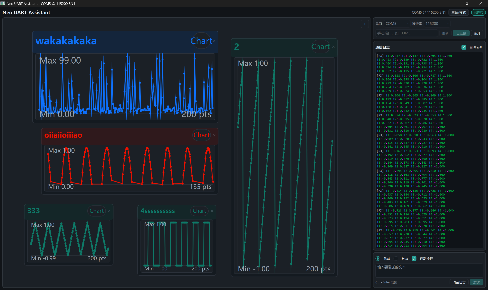

<p align="center">
  <h1 align="center">Neo Serial Assistant</h1>
  <p align="center">
    <strong>桌面端串口调试 & 实时数据监测工具</strong><br/>
    用正则表达式从串口数据流中抓取关键参数，高度自定义配置可拖拽监测、控制卡片
  </p>
</p>

<p align="center">
  <a href="LICENSE"></a>
  
  
  
  
  
</p>

---

<p align="center">
  
</p>

## 功能亮点

**串口通信**
- 自动扫描可用串口，支持手动指定端口
- 波特率 9600 ~ 921600，一键连接/断开
- Text / Hex 双模式发送，可选自动换行

**实时监测卡片**
- 通过正则表达式从数据流中提取数值/布尔参数
- 简单模式：只需填前缀和后缀，零正则基础也能用
- 高级模式：手写正则，支持捕获组、负数、自定义布尔映射
- 每张卡片可切换 **数值视图** / **实时折线图**
- 自由拖拽定位、四边缩放、鼠标滚轮缩放画布、中键平移视野
- 卡片不在视野内时显示方向指示标，点击即可跳转

**通信日志**
- 彩色富文本渲染（字母/数字/符号分色，TX/RX/SYS 标记）
- 自动滚动，日志上限自动裁剪，内存占用稳定
- 字体、字号、各类颜色均可自定义

**个性化**
- 内置浅色 / 深色 / 暖色三套主题，一键切换
- 卡片配置、布局、主题偏好均自动持久化

---

## 快速开始

### 环境要求

| 依赖 | 最低版本 |
|------|----------|
| Qt   | 6.8      |
| CMake | 3.16    |
| C++ 编译器 | 支持 C++17（MinGW / MSVC） |

### 构建

UNDER CONSTRUCTION...

启动后：
1. 选择串口和波特率，点击 **连接**
2. 点击卡片区域右上角 **+** 新建监测卡片
3. 填写前缀/后缀（如 `temp=` / `°C`），选择类型，点击 **创建**
4. 串口数据命中匹配规则时，卡片数值自动更新

---

## 项目结构

```
neo-serial-gui/
├── core/                       # 纯 C++ 核心库（无 Qt 依赖）
│   ├── session/                #   会话管理、消息收发
│   ├── transport/              #   传输层抽象 & UART 实现
│   └── parameter/              #   参数卡片：正则匹配引擎
├── gui/neo-serial-gui/         # Qt Quick 前端
│   ├── modules/
│   │   ├── MainWindow.qml      #   主窗口（完整 UI）
│   │   └── controls/           #   自定义控件组件
│   ├── session_bridge.cpp/h    #   Session ↔ QML 桥接
│   ├── card_bridge.cpp/h       #   ParameterCard ↔ QML 桥接
│   └── main.cpp                #   入口
├── tester/                     # 独立测试用例
├── data/                       # 运行时数据（卡片配置 JSON）
├── docs/                       # 设计文档 & 用户指南
├── img/                        # 截图素材
└── reference/                  # 参考配置文件
```

---

## 卡片匹配示例

<table>
<tr>
<th>场景</th><th>串口数据</th><th>填写方式</th>
</tr>
<tr>
<td>温度传感器</td>
<td><code>temp=25.3°C</code></td>
<td>前缀 <code>temp=</code>，后缀 <code>°C</code>，类型：数值</td>
</tr>
<tr>
<td>负数电压</td>
<td><code>Vout=-3.72V</code></td>
<td>前缀 <code>Vout=</code>，后缀 <code>V</code>，类型：数值，勾选支持负数</td>
</tr>
<tr>
<td>水泵开关</td>
<td><code>pump=ON</code></td>
<td>前缀 <code>pump=</code>，类型：布尔，True=ON，False=OFF</td>
</tr>
<tr>
<td>复杂格式（高级）</td>
<td><code>T21: ADC=0xA3, Temp=42.5°C</code></td>
<td>正则 <code>Temp=([-+]?\d+\.\d+)°C</code></td>
</tr>
</table>

> 详细用法请参考 [监测卡片使用指南](docs/user/monitor-card-guide.md)

---

## 文档

| 文档 | 说明 |
|------|------|
| [监测卡片使用指南](README_CARD.md) | 创建、操作卡片的完整教程 |
---

## License

[MIT](LICENSE) &copy; Neo Embedded

---

## Card Area Updates

- The card canvas now shows a grid background.
- A `Grid Snap` toggle is available in the upper-left corner of the card area.
- When `Grid Snap` is enabled, moving cards, resizing cards, and newly created card positions snap to the grid.
- Double-click a card title to rename it quickly in place.
- Double-click a card body area, excluding buttons, to open the card editor with the current configuration prefilled.
- The card editor reuses the same form as card creation, and switches between create/edit modes automatically.
- Chart cards now use capped internal render resolution, so enlarging a card scales the display without increasing render cost proportionally.

## Card Editing Shortcuts

- `Double-click title`: quick rename current card.
- `Double-click card body`: open `Edit Monitor Card`.
- `Enter`: confirm inline rename.
- `Esc`: cancel inline rename.

## Build Note

- Preset-based build remains unchanged:
- `cd gui/neo-serial-gui`
- `cmake --preset qt6-mingw-debug`
- `cmake --build --preset build-debug`
